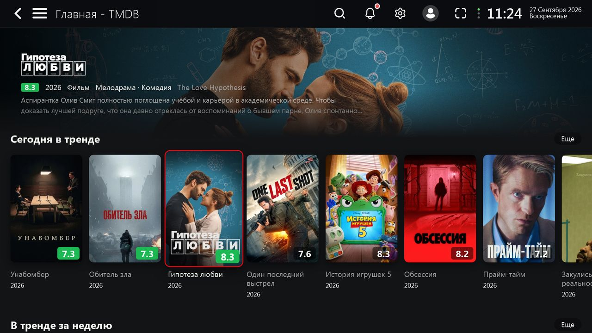

# Lampa plugins.

Plugins for [Lampa](https://github.com/yumata/lampa), a media center app for TVs, Android and browsers. The plugins' interface is in Russian, like Lampa itself.

| Plugin | What it does | Install link |
|---|---|---|
| [Kids («Детям»)](docs/kids.md) | movies and cartoons picked by the child's age | `https://cdn.jsdelivr.net/gh/mvinkarklins/lampa@latest/kids_age.js` |
| [Torrents button](docs/torrent-button.md) | a «Торренты» button on the movie card; searches your own parser and public JacRed | `https://cdn.jsdelivr.net/gh/mvinkarklins/lampa@latest/torrent_button.js` |
| [Neo interface](docs/neo.md) | a redesigned Lampa with five themes | `https://cdn.jsdelivr.net/gh/mvinkarklins/lampa@latest/neo.js` |
| [LG tracks](docs/lg-tracks.md) | audio track picker in the player on LG TVs | `https://cdn.jsdelivr.net/gh/mvinkarklins/lampa@latest/lg_tracks.js` |
| [Profiles](docs/profiles.md) | profiles and sync through your own [server](sync/README.md) | `https://cdn.jsdelivr.net/gh/mvinkarklins/lampa@latest/profiles.js` |

## Install

In Lampa: Settings → Extensions → Add plugin, paste an install link, and restart Lampa. With the Profiles plugin, plugins installed on one device appear on all of them.

All plugins are plain ES5 JavaScript with no build step, so they run on old TV browsers.

[](docs/neo.md)

## Development and releases

Every plugin has two links:

| | Link | Serves | Updates |
|---|---|---|---|
| **prod** | `https://cdn.jsdelivr.net/gh/mvinkarklins/lampa@latest/<file>.js` | the latest release (tag `vX.Y.Z`) | right after `release.sh`, otherwise up to 12 hours |
| **dev** | `https://mvinkarklins.github.io/lampa/<file>.js` | the current `main` branch (GitHub Pages) | 1–2 minutes after a push |

To test changes, install the dev link in Lampa. When everything works, bump `VERSION` in the changed plugin, commit, and release all plugins at once:

```
./release.sh 3.0.1
```

The script tags the commit, pushes the tag and purges the jsDelivr `@latest` cache for every `*.js` file. A specific release can be pinned with `@v3.0.0` instead of `@latest`.

## Repository layout

| Path | Content |
|---|---|
| `*.js` | the plugins; they stay in the root because their paths are their install URLs |
| `docs/` | documentation of each plugin and screenshots |
| `sync/` | the profile sync server |
| `release.sh` | release all plugins: tag, push, purge the jsDelivr cache |
| `tests/` | smoke test in the live Lampa (headless Chromium) and a unit test for LG tracks |
| `.github/workflows/` | syntax and ES5 checks and the tests on every push and weekly; jsDelivr cache purge on every tag |
| `CHANGELOG.md` | changes per release |

The Stremio addon has moved to its own repository, [stremio-hits](https://github.com/mvinkarklins/stremio-hits).

## License

[MIT](LICENSE)
