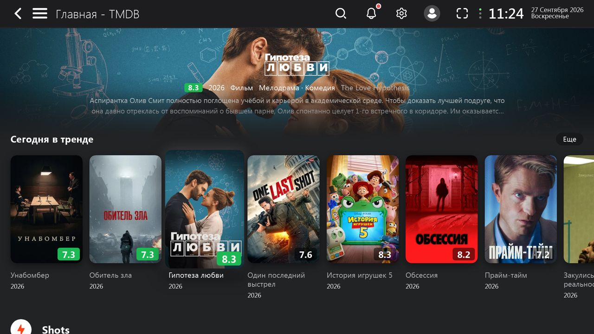
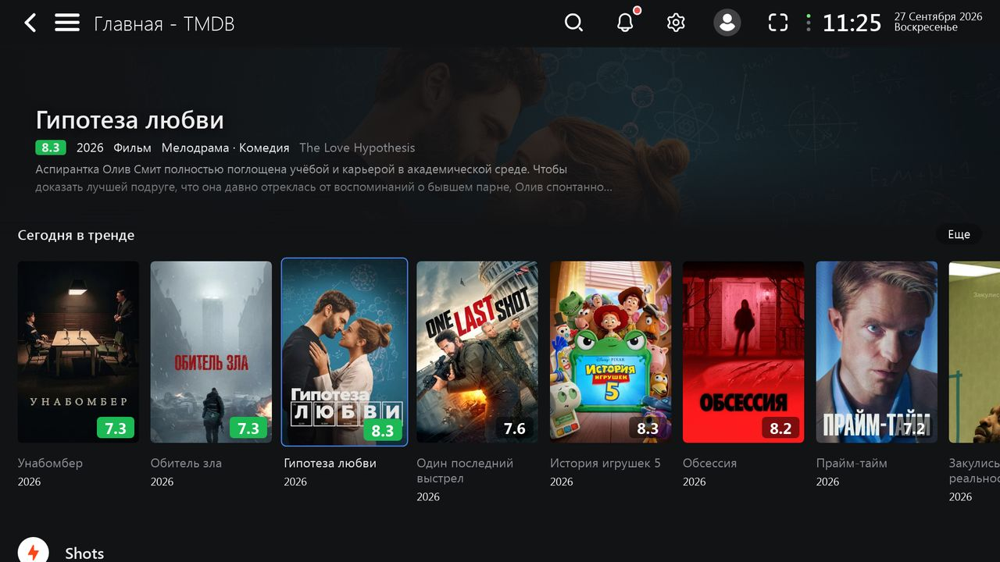
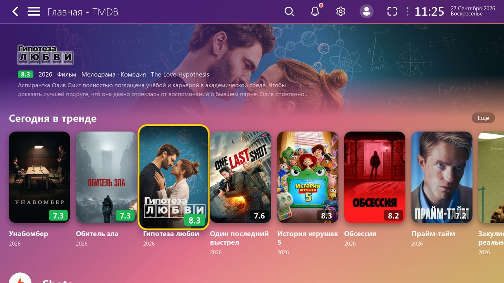
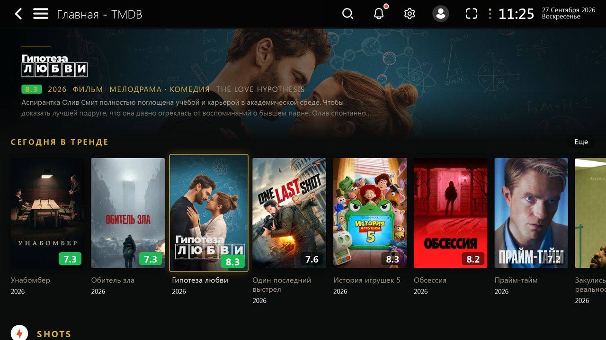

# Neo interface

`neo.js` restyles Lampa: rounded posters with a clear focus and colored ratings; on the home screen and in collections, a banner above the rows shows the backdrop, logo and description of the focused movie; the movie card shows the logo instead of the title and pill-shaped buttons.

```
https://cdn.jsdelivr.net/gh/mvinkarklins/lampa@latest/neo.js
```

Enable it in Settings → Interface → «Интерфейс Neo». The same section has:

**Theme** («Тема Neo»):

| Theme | Look |
|---|---|
| Netflix | dark, red accent, description on the left |
| Apple TV | soft corners, large glowing focus, description centered |
| Minimal | flat, blue accent, text title, compact banner |
| Kids | purple-pink gradient, big corners, yellow focus, colored logos |
| Cinema | black and gold, spaced uppercase row titles, sharp buttons |

| Netflix | Apple TV |
|---|---|
|  |  |
| **Minimal** | **Kids** |
|  |  |
| **Cinema** | |
|  | |

**Banner** («Баннер Neo»): compact (default, about a third of the screen: logo, rating, year, genres, two lines of description), large, or off.

**Posters** («Постеры Neo»): smaller (default, 7–8 posters per row instead of 6), tiny, or normal.

The banner backdrop loads at 1280 px first; if focus stays on a movie for over a second, it is replaced with the TMDB original (usually 1920×1080, sometimes 4K). TMDB has no 1920 size.

Movie logos are shown as a white silhouette (except in the Kids theme): some TMDB logos are dark, and CORS prevents reading image colors in the browser.

The on/off flag, theme, banner and poster sizes are stored in the profile, so Neo can be enabled for one profile only. With the flag off, the plugin changes nothing.

[← All plugins](../README.md)
